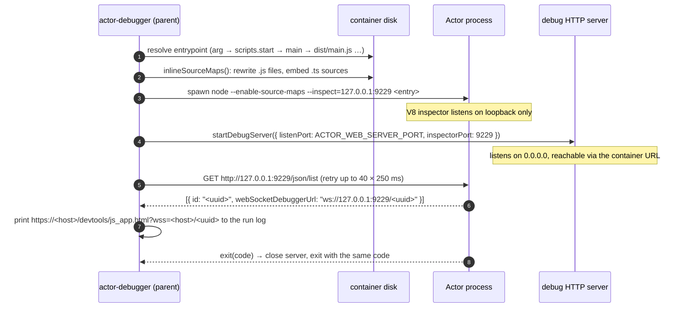
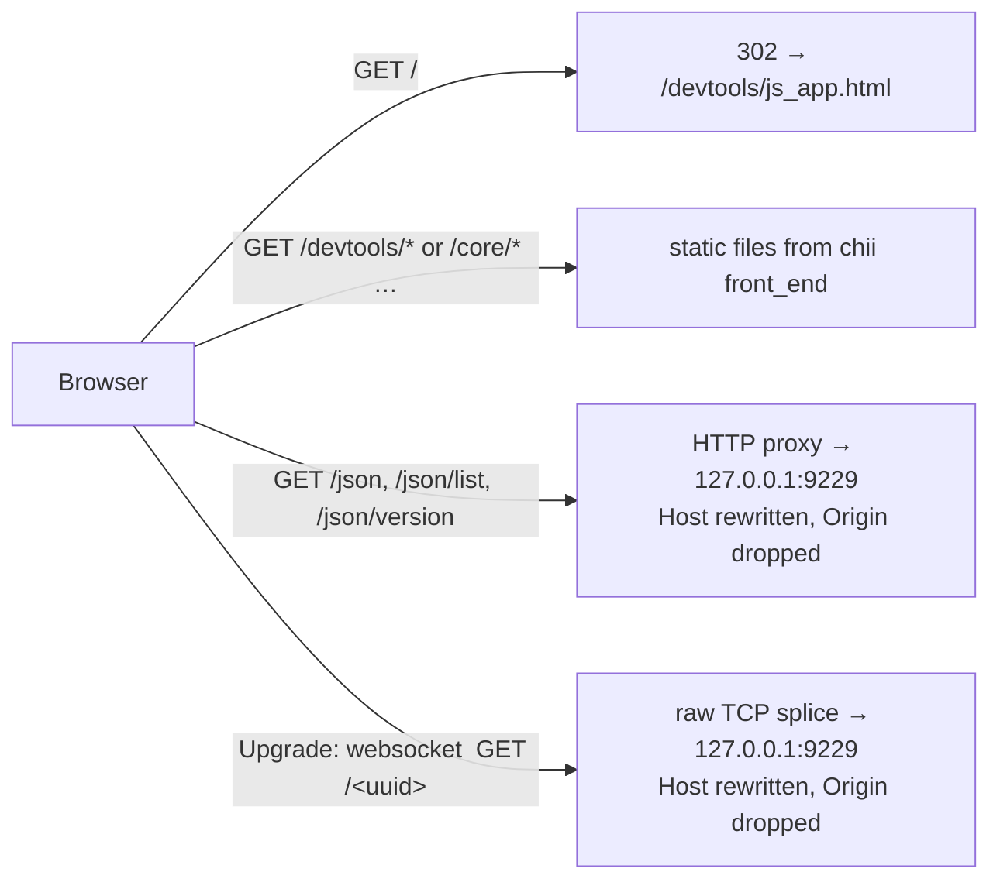

# actor-debugger: architecture

A walkthrough of how `actor-debugger` turns any Apify Node/TS Actor into a remotely debuggable
process with one Dockerfile line, and how a browser on your laptop ends up attached to a process
running inside an Apify container. Written for presenting the design; every claim below is
grounded in the code in `bin/` and `lib/` or was verified against Node and the platform docs.

## 1. The one-slide version

Three parties, two network hops, one process boundary:

```
 your laptop                       Apify platform                     Actor container
┌──────────────┐   https / wss   ┌────────────────┐   http / ws    ┌──────────────────────────────┐
│ any browser  │ ─────────────▶ │ ingress for    │ ────────────▶ │ actor-debugger (parent)      │
│ running the  │                │ <key>.runs.    │  port 4321     │  • serves DevTools UI        │
│ DevTools UI  │ ◀───────────── │ apify.net      │ ◀──────────── │  • proxies CDP WebSocket     │
└──────────────┘                └────────────────┘                │        │ ws 127.0.0.1:9229    │
                                                                  │        ▼                      │
                                                                  │ node --inspect dist/main.js  │
                                                                  │ (your Actor, unmodified)     │
                                                                  └──────────────────────────────┘
```

- The Actor runs exactly as before, in its own process, with the built-in V8 inspector switched on.
- `actor-debugger` is a thin parent process. It launches the Actor and runs one HTTP server on the
  port the platform already exposes for every run.
- Your browser opens one URL from the run log. That page is Chrome DevTools, served from the
  container, and it talks to the Actor's inspector through the same container URL.

Nothing is installed locally, no browser runs in the container, and the Actor's source code is not
touched.

## 2. Components

| Piece | Where | Role |
| --- | --- | --- |
| CLI launcher | `bin/cli.mjs` | Entry point of `npx actor-debugger`. Finds the Actor entrypoint, inlines source maps, spawns the Actor under `--inspect`, starts the debug server, prints the connect URL, forwards signals and the exit code. |
| Debug server | `lib/debug_server.mjs` | One `http.Server` on `ACTOR_WEB_SERVER_PORT`. Serves the DevTools frontend as static files, proxies `/json*` discovery, and splices CDP WebSocket connections through to the inspector. |
| Source-map inliner | `lib/inline_sourcemaps.mjs` | Startup pass over compiled `.js` files. Turns external `.js.map` references into inline `data:` URLs with the original TS text embedded. |
| DevTools frontend | `node_modules/chii/public/front_end` | A prebuilt Chrome DevTools UI (about 15 MB of static files) from the `chii` package. Served to the browser; nothing in it runs inside the container. |
| The Actor | your `dist/main.js` | Unchanged. Runs as a child process with the V8 inspector listening on loopback only. |
| Apify container web server | platform feature | Every run gets `https://<key>.runs.apify.net`, forwarded by the platform to the container port in `ACTOR_WEB_SERVER_PORT` (4321 by default). |

The whole package is two library files plus the CLI, with a single runtime dependency (`chii`)
that exists only to provide the frontend files.

## 3. Boot sequence

What happens when the container starts with `CMD ["npx", "actor-debugger"]`:



Points worth calling out:

- **Entrypoint detection** mirrors what the Actor would normally run: an explicit argument wins,
  then the file named in `package.json` `scripts.start`, then `main`, then conventional paths.
- **`--brk`** switches `--inspect` to `--inspect-brk`, pausing on the first line until a debugger
  attaches. Without it, a short-lived Actor could finish before anyone connects.
- **Lifecycle is transparent.** stdio is inherited, so Actor logs still flow to the run log.
  `SIGTERM`/`SIGINT` are forwarded to the child. The parent exits with the child's exit code, so
  the platform sees the run succeed or fail exactly as it would without the debugger.

## 4. How the code communicates with the debugger

The Actor code does not talk to `actor-debugger` at all. There is no import, no SDK hook, no
instrumentation. The communication channel is entirely Node's built-in inspector:

1. **`--inspect=127.0.0.1:9229`** makes the V8 engine inside the Actor process open an inspector
   server. It speaks the Chrome DevTools Protocol (CDP) over WebSocket: JSON messages such as
   `Debugger.setBreakpointByUrl`, `Debugger.paused`, `Runtime.evaluate`. Breakpoints, stepping,
   the call stack and scope inspection all happen inside V8. Nothing is added to the Actor.
2. **Loopback only.** The inspector is bound to `127.0.0.1`, so it is never reachable from outside
   the container directly. The only way in is through the debug server, which is what lets the
   design stay a single exposed port.
3. **Discovery via `/json/list`.** The inspector exposes a small HTTP API. `actor-debugger` calls
   it locally to obtain the session `uuid`, the one piece of information needed to build the
   WebSocket path `/<uuid>`. Note that the inspector's own `webSocketDebuggerUrl` and
   `devtoolsFrontendUrl` point at `127.0.0.1:9229`, which is useless to a remote browser. That is
   why the CLI constructs the public URL itself instead of forwarding what the inspector prints.
4. **`--enable-source-maps`** is passed to the child so stack traces in the Actor's own logs point
   at TypeScript lines too, not only the DevTools view.
5. **Parent and child are separate processes.** The debugger's HTTP server, static-file I/O and
   proxying run in the parent. A breakpoint that pauses the Actor does not pause the proxy, and a
   crash in the Actor does not take the server down before the exit code is reported.

The one thing the debugger does touch is the compiled output on disk, once, before the Actor
starts. Section 5 explains why.

## 5. Why a DevTools frontend is served from the Actor, and what it does

### The problem

Node prints a `devtools://devtools/bundled/js_app.html?ws=127.0.0.1:9229/<uuid>` URL for local
debugging. That approach breaks down remotely for several reasons:

- `devtools://` URLs are Chrome-internal. They need Chrome, and the bundled frontend version is
  tied to the local browser, not to the target.
- `chrome://inspect` network targets accept only `host:port` and discover over plain HTTP. The
  container URL is `https://` on port 443 with a WebSocket path, which does not fit that model.
- The inspector's discovery endpoint reports loopback addresses (see section 4), so even a proxied
  `/json/list` would hand a remote browser URLs it cannot use.
- There is no browser in the container to open anything. `apify/actor-node` images have no
  Chrome, and adding one plus Xvfb or VNC to debug is exactly the heavy setup this project avoids.

### The solution

Serve the DevTools UI itself from the container, over the container URL, as static files. The
browser downloads the UI from `https://<key>.runs.apify.net/devtools/js_app.html` and the UI then
opens a WebSocket back to the same host. Two consequences follow:

- **Any browser works.** The page is plain HTML and JavaScript. No `devtools://`, no extension,
  no Chrome-only entry point.
- **Same origin for UI and WebSocket.** Both come from the container URL, so there is no
  mixed-content issue and no cross-origin surprise; the scheme is `wss` whenever the page is
  `https`.

The frontend files come from **`chii`**, which ships a prebuilt Chrome DevTools frontend. The
official `chrome-devtools-frontend` npm package is unbuilt TypeScript that needs Chromium's GN and
ninja toolchain to compile, so it cannot be served directly. `chii` is the same frontend, already
built; `actor-debugger` only borrows its `public/front_end` directory and never runs chii's own
server.

### What the frontend does

The frontend runs entirely in your browser tab. Once loaded it:

1. Reads the `ws=` or `wss=` query parameter and opens `ws://…` or `wss://…` accordingly. This is
   standard DevTools behaviour (`WebSocketConnection` in `core/sdk`), not a chii addition, which is
   why the CLI picks the parameter name from the container URL's scheme.
2. Speaks CDP to the inspector: enables the `Debugger` and `Runtime` domains, receives
   `Debugger.scriptParsed` events for every loaded script, sends breakpoint and stepping commands.
3. Resolves source maps to show TypeScript instead of compiled JavaScript. This is where the
   remote setup bites again, and where the startup source-map pass comes in.

### Why source maps are rewritten on disk

A normal tsc build emits `dist/main.js` with a trailing `//# sourceMappingURL=main.js.map`. When
DevTools sees that comment it fetches the map, and the map's `sources` entries point at
`../src/main.ts`. Locally this works because the frontend resolves them to `file://` URLs. A remote
frontend in your browser has no access to the container's filesystem, so both the `.map` file and
the `.ts` sources are unreachable and DevTools shows "Source map failed to load".

The only data a remote frontend receives is what travels through the inspector: the script text
itself. So before the Actor starts, `inlineSourceMaps()` walks the compiled output and, for each
`.js`/`.mjs`/`.cjs` file that references a map:

- reads the external `.map` from disk;
- fills in `sourcesContent` by reading each referenced `.ts` file from the image;
- rewrites the `sourceMappingURL` comment to a base64 `data:application/json` URL carrying the
  whole map.

Now the map and the original sources are embedded in the script text, which V8 hands to DevTools
via `Debugger.scriptParsed`, and the frontend can show and set breakpoints in TypeScript. Maps
that were already inline only get missing `sourcesContent` filled. The pass skips `node_modules`,
storage directories and dotfiles, and stops after 5000 files. If the `.ts` files are not in the
image (a multi-stage build copying only `dist/`), mappings still inline but the log reports how
many sources are missing.

## 6. How an outside browser reaches the debugger through the container URL

### The platform half

Every Apify run has a container URL of the form `https://<key>.runs.apify.net`, exposed in the
console, in the API run object, and inside the container as `ACTOR_WEB_SERVER_URL`. The platform
forwards requests on that URL to whatever listens on `ACTOR_WEB_SERVER_PORT` (4321 unless
overridden) inside the container. This is the same mechanism Actors use for status pages or small
APIs; `actor-debugger` simply puts the debug server on that port instead. If either variable is
missing, for example when running outside the platform, the CLI still starts the Actor under
`--inspect` and says the bridge is off.

### The debug server half

One HTTP server handles three kinds of traffic:



- **Static files.** Anything that is not `/json*` or a WebSocket upgrade is treated as a frontend
  asset. The `/devtools/` prefix is stripped, but root-relative paths such as `/core/...` also
  resolve into the frontend directory, because `js_app.html` loads modules both ways. Path
  traversal is blocked and the correct MIME type is set for `.js`, `.wasm`, `.woff2` and friends.
- **`/json*` proxy.** Discovery requests are forwarded to the inspector over HTTP. This keeps the
  raw channel usable for tools that expect the standard inspector layout.
- **WebSocket upgrade.** This is the core of the bridge and is deliberately dumb. On `upgrade`
  the server opens a plain TCP socket to `127.0.0.1:9229`, rewrites the HTTP request line and
  headers, writes them upstream, then pipes the two sockets into each other in both directions.
  It never parses a CDP frame, so it adds no protocol-version coupling and negligible latency.

### The Host header rewrite, and why it is the whole trick

Node's inspector refuses HTTP and WebSocket requests whose `Host` header is a DNS name. This is
its defence against DNS rebinding attacks, and it applies to `/json/list` as well as to the
WebSocket upgrade. Tested against Node 22:

| `Host` header sent to `127.0.0.1:9229/json/list` | Result |
| --- | --- |
| `127.0.0.1:9229` | 200 |
| `localhost:9229` | 200 |
| `myrun.runs.apify.net` | 400 |

A browser always sends the host it connected to, which here is `<key>.runs.apify.net`. Passed
through unchanged, every connection would be rejected. The proxy therefore replaces `Host` with
`127.0.0.1:9229` on both the `/json*` proxy and the WebSocket upgrade. `Origin` is dropped at the
same time so the inspector sees a plain, non-browser client. Everything else, including the
`Sec-WebSocket-Key` handshake headers, is forwarded verbatim so the inspector's handshake reply
matches what the browser expects.

### End-to-end connection

```mermaid
sequenceDiagram
    autonumber
    participant U as Browser (laptop)
    participant P as Apify ingress
    participant S as debug server :4321
    participant I as V8 inspector 127.0.0.1:9229

    U->>P: GET https://<key>.runs.apify.net/devtools/js_app.html?wss=<key>.runs.apify.net/<uuid>
    P->>S: forward to container port
    S-->>U: js_app.html + ~15 MB of DevTools assets (static)
    Note over U: DevTools boots, reads the wss= param
    U->>P: WebSocket upgrade wss://<key>.runs.apify.net/<uuid>  (Host: <key>.runs.apify.net)
    P->>S: forward upgrade
    S->>I: TCP connect, replay upgrade with Host: 127.0.0.1:9229, no Origin
    I-->>S: 101 Switching Protocols
    S-->>U: 101 (bytes piped back unchanged)
    Note over U,I: sockets spliced; CDP JSON flows both ways
    U->>I: Debugger.enable, Debugger.setBreakpointByUrl …
    I-->>U: Debugger.scriptParsed (with inline source maps), Debugger.paused …
```

The same `wss://<key>.runs.apify.net/<uuid>` endpoint works for any CDP client: `wscat` for a
raw session, or `Playwright`/`Puppeteer` `connectOverCDP`. The served UI is a convenience on top of
the channel, not a requirement.

### Scheme selection

The printed URL uses `wss=` when `ACTOR_WEB_SERVER_URL` starts with `https://` and `ws=` when it
starts with `http://`. The platform serves `https`, so `wss`. A local Apify dev stack serves
`http://localhost:…`, and attempting `wss` against it fails the TLS handshake with a generic
"WebSocket disconnected" in DevTools. Always use the URL exactly as printed.

## 7. Security model, stated plainly

The debug endpoint has **no authentication**. The `uuid` in the path is the only secret, and it is
printed in the run log. Anyone who can reach the container URL and knows the `uuid` can run
arbitrary code inside the Actor via `Runtime.evaluate`, which includes reading `process.env` and
therefore `APIFY_TOKEN`.

Consequences for use:

- Keep the `actor-debugger` `CMD` only in builds you are actively debugging.
- Never ship it in a published Actor.
- Prefer a restricted run or token while debugging.
- Any use beyond prototyping needs an owner-only gate in front of the endpoint. This is the main
  open design item.

## 8. Fallback and degraded modes

| Situation | Behaviour |
| --- | --- |
| `ACTOR_WEB_SERVER_PORT`/`URL` not set (not on the platform) | Actor runs under `--inspect` on loopback; no debug server; log says the bridge is off. |
| `chii` not resolvable | Debug server still runs; `/json*` and the WebSocket proxy work; UI requests return 404 and the log says "serving CDP only". |
| No source maps in the build | Actor debugs as compiled JS; log hints to compile with `"sourceMap": true`. |
| `.ts` sources missing from the image | Maps inline, but DevTools cannot show original text; log reports the count and suggests copying `src/`. |
| Inspector does not come up within about 10 s | Log reports it; the Actor keeps running. |

## 9. Verification status

Verified end to end against the browserless sample Actor in `example-actor/` on plain
`apify/actor-node:22`:

- entrypoint auto-detection and explicit-path modes;
- `/devtools/js_app.html` and assets served, `/json` proxied, `Runtime.evaluate` round-trips
  through the proxy with browser-like `Host`/`Origin` headers;
- headless Chromium loaded the served frontend and the Node inspector reported
  "Debugger attached".

The publish workflow repeats a smoke test of both modes on every release tag. One item the README
still flags for confirmation on real infrastructure is WebSocket behaviour when the Apify ingress
negotiates HTTP/2.

## 10. Suggested talking points

- **One line, zero code changes.** The switch is the Dockerfile `CMD`; turning it off is reverting
  that line.
- **The Actor is the debuggee, not the host.** The debugger is a parent process. The Actor never
  imports anything.
- **Reuse what the platform already gives you.** The container URL and web-server port exist for
  every run; the debugger just puts a purpose-built server there.
- **The frontend must live in your browser, so it is served from the container.** No browser in
  the image, no Chrome-specific URLs, works everywhere.
- **Two small tricks make it work remotely:** rewriting `Host` to a loopback address for Node's
  anti-DNS-rebinding check, and inlining source maps because a remote frontend cannot read the
  container's disk.
- **Security is the known gap.** Unauthenticated by design of the prototype; gate before wider use.
